# AWS 3-Tier Network Deployment Guide

---

## Prerequisites

This guide assumes the following:
- Access to an AWS account or AWS Academy Learner Lab environment
- Ability to navigate and utilize AWS interfaces
- Basic familiarity with subnetting, routing, and access control concepts

> **Note:** This project was deployed in an AWS Academy Learner Lab environment. Due to the permissions allocated, some IAM actions are restricted.

---

## Table of Contents

1. [Purpose](#1-purpose)
2. [Required Technologies](#2-required-technologies)
3. [Architecture Overview](#3-architecture-overview)
4. [VPC and Subnet Configuration](#4-vpc-and-subnet-configuration)
5. [Routing Configuration](#5-routing-configuration)
6. [Security Groups and NACLs](#6-security-groups-and-nacls)
7. [IAM Roles and Least Privilege Access](#7-iam-roles-and-least-privilege-access)
8. [AWS Systems Manager Configuration](#8-aws-systems-manager-configuration)
9. [Traffic Logging](#9-traffic-logging)
10. [Testing and Verification](#10-testing-and-verification)

---

## 1. Purpose

This guide covers the design and deployment of a segmented three-tier network architecture in AWS. It demonstrates some basic principles including:

- **Network Segmentation:** Isolating web, app, and data tiers into separate subnets to limit lateral movement and reduce attack surface.
- **Layered Traffic Control:** Enforcing traffic policy at both the subnet level (NACLs) and instance level (security groups).
- **Least Privilege Access:** Scoping instance permissions to the minimum required for each tier's function.
- **Auditable Access:** Using AWS Systems Manager for instance management instead of direct SSH, removing the need port 22.
- **Traffic Visibility:** Providing the ability to log IP traffic.

---

## 2. Required Technologies

| Component | Purpose |
|-----------|---------|
| Amazon VPC | Isolated network environment for the project |
| EC2 | Instances for each tier (web, app, data) |
| Security Groups | Stateful, instance level traffic control |
| Network ACLs | Stateless, subnet level traffic control |
| IAM (LabRole) | Instance permissions, including SSM management, limited in Learner Lab |
| AWS Systems Manager (SSM) | Remote instance management without SSH/bastion |
| VPC Interface Endpoints | Private connectivity to SSM from a subnet with no internet route |
| VPC Flow Logs | IP traffic logging for each subnet |
| Amazon S3 Buckets | Log storage |

---

## 3. Architecture Overview

The environment consists of a single VPC divided into three subnets, each representing one tier of the stack. 

| Tier | Subnet | CIDR | Purpose |
|------|--------|------|---------|
| Web | subnet-web | 10.0.1.0/24 | Public-facing tier, runs a web server |
| Application | subnet-app | 10.0.2.0/24 | Handles internal application |
| Data | subnet-data | 10.0.3.0/24 | Database tier, most restricted, no internet route |

VPC CIDR: `10.0.0.0/16`, Region: `us-west-2` (Oregon).

All instances are managed exclusively through AWS Systems Manager Session Manager. No inbound SSH rules are configured on any security group, and no key pairs were attached to any instance.

---

## 4. VPC and Subnet Configuration

### 4.1 VPC Creation

| Property | Value |
|----------|-------|
| Name | vpc-3tier |
| IPv4 CIDR | 10.0.0.0/16 |
| Region | us-west-2 |
| Tenancy | Default |
| DNS resolution | Enabled |
| DNS hostnames | Enabled |
| Encryption control mode | Disabled |

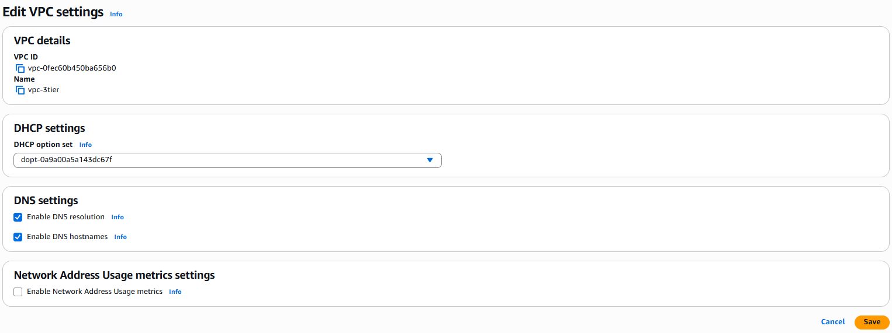

### 4.2 Subnet Creation

| Subnet | CIDR | Availability Zone |
|--------|------|--------------------|
| subnet-web | 10.0.1.0/24 | us-west-2a |
| subnet-app | 10.0.2.0/24 | us-west-2a |
| subnet-data | 10.0.3.0/24 | us-west-2a |

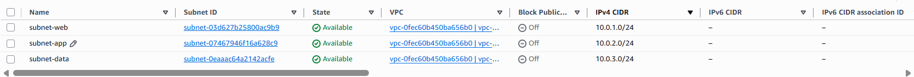

---

## 5. Routing Configuration

### 5.1 Internet Gateway

An Internet Gateway (`igw-3tier`) was created and attached to `vpc-3tier` to provide internet access to the web tier only.

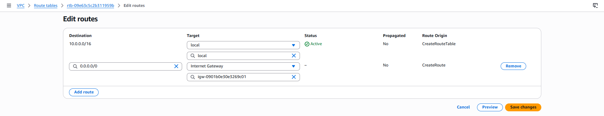

### 5.2 NAT Gateway

A NAT Gateway (`nat-3tier`) was created in `subnet-web` to give the app tier outbound internet access (needed for SSM). No inbound internet traffic was permitted.

| Setting | Value |
|---|---|
| Availability mode | Zonal |
| Subnet | subnet-web |
| Connectivity type | Public |
| Elastic IP | Automatic allocation |

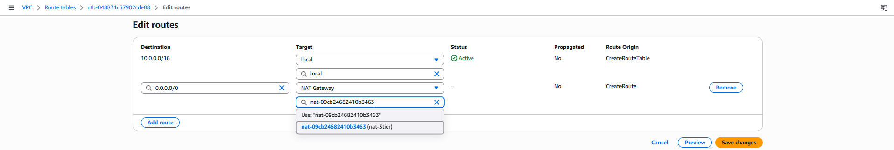

### 5.3 Route Tables

| Route Table | Associated Subnet | Destination | Target |
|-------------|--------------------|--------------|--------|
| rt-web | subnet-web | 0.0.0.0/0 | Internet Gateway |
| rt-app | subnet-app | 0.0.0.0/0 | NAT Gateway |
| rt-data | subnet-data | (local only) | — |

`subnet-data` has no route to the internet at all — this is the primary control that isolates the data tier, verified in [Section 10](#10-testing-and-verification).

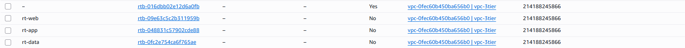
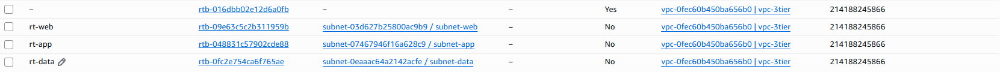

---

## 6. Security Groups and NACLs

### 6.1 Security Groups (Stateful, Instance-Level)

| Security Group | Inbound Rule | Source | Purpose |
|-----------------|--------------|--------|---------|
| web-sg | TCP 80, TCP 443 | 0.0.0.0/0 | HTTP/HTTPS from internet |
| app-sg | TCP 8080 | web-sg | App traffic from web tier only |
| data-sg | TCP 3306 | app-sg | DB traffic from app tier only |
| endpoints-sg | TCP 443 | web-sg, app-sg, data-sg | VPC endpoint access from all three tiers |

> **Note:** Security group names avoid the `sg-` prefix, which AWS reserves for auto-generated security group IDs and rejects in custom names.

`endpoints-sg` exists as a separate group to keep access to endpoints and the database separate. These are single purpose rulesets to keep each security group and ruleset specific, reducing overlap.

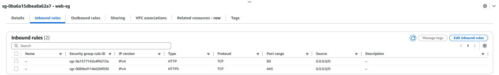
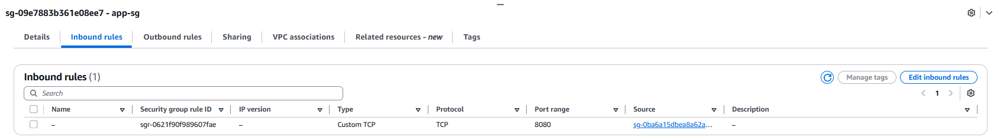
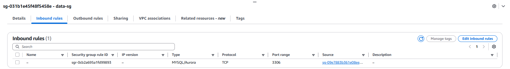

### 6.2 Network ACLs (Stateless, Subnet-Level)

**web-nacl**

| Direction | Rule # | Type | Port | Source/Destination | Allow/Deny |
|-----------|--------|------|------|----------------------|------------|
| Inbound | 100 | HTTP | 80 | 0.0.0.0/0 | Allow |
| Inbound | 105 | HTTPS | 443 | 0.0.0.0/0 | Allow |
| Inbound | 110 | Custom TCP | 1024–65535 | 0.0.0.0/0 | Allow |
| Outbound | 100 | Custom TCP | 1024–65535 | 0.0.0.0/0 | Allow |
| Outbound | 105 | HTTPS | 443 | 0.0.0.0/0 | Allow |
| Outbound | 110 | HTTP | 80 | 0.0.0.0/0 | Allow |

**app-nacl**

| Direction | Rule # | Type | Port | Source/Destination | Allow/Deny |
|-----------|--------|------|------|----------------------|------------|
| Inbound | 100 | Custom TCP | 8080 | 10.0.1.0/24 (web) | Allow |
| Inbound | 105 | Custom TCP | 1024–65535 | 10.0.3.0/24 (data) | Allow |
| Inbound | 110 | Custom TCP | 1024–65535 | 0.0.0.0/0 | Allow |
| Outbound | 100 | Custom TCP | 3306 | 10.0.3.0/24 (data) | Allow |
| Outbound | 105 | Custom TCP | 1024–65535 | 10.0.1.0/24 (web) | Allow |
| Outbound | 110 | HTTPS | 443 | 0.0.0.0/0 | Allow |

**data-nacl**

| Direction | Rule # | Type | Port | Source/Destination | Allow/Deny |
|-----------|--------|------|------|----------------------|------------|
| Inbound | 100 | Custom TCP | 3306 | 10.0.2.0/24 (app) | Allow |
| Inbound | 105 | Custom TCP | 443 | 10.0.1.0/24 (web) | Allow |
| Inbound | 110 | Custom TCP | 443 | 10.0.2.0/24 (app) | Allow |
| Outbound | 100 | Custom TCP | 1024–65535 | 10.0.2.0/24 (app) | Allow |
| Outbound | 105 | Custom TCP | 1024–65535 | 10.0.1.0/24 (web) | Allow |
| Outbound | 110 | Custom TCP | 1024–65535 | 10.0.2.0/24 (app) | Allow |

`data-nacl` includes rules for HTTPS traffic from `subnet-web` and `subnet-app` in addition to its 3306 database rule. This is because the SSM VPC interface endpoints (see [Section 8](#8-aws-systems-manager-configuration)) are located in `subnet-data`.

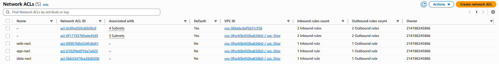
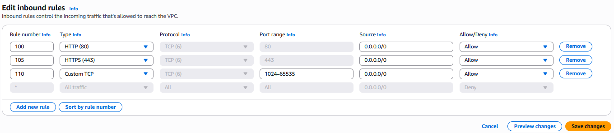
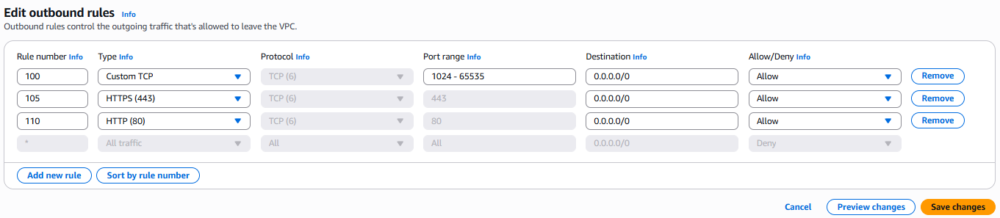

---

## 7. IAM Roles and Least Privilege Access

> **Note:** This project was deployed in an AWS Academy Learner Lab, which blocks `iam:CreateRole`. Creating tier specific roles tailored to a tiers needs was not possible.

All instances use  **`LabRole`**, which includes 7 managed policies, including `AmazonSSMManagedInstanceCore`.

In a full-access AWS system, three scoped roles would be implemented with the addition of tier specific permissions required for each tier. This would improve the enforcement of least privilege access control at the identity level. 

| Instance | Role (via instance profile) | Purpose |
|----------|-------------------------------|---------|
| web-instance | LabRole | SSM management |
| app-instance | LabRole | SSM management |
| data-instance | LabRole | SSM management |

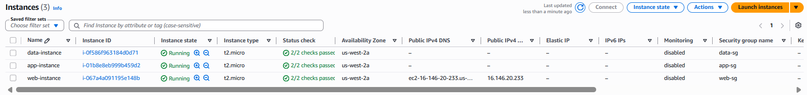

---

## 8. AWS Systems Manager Configuration

Systems Manager was used for management of all instances. This eliminated the need for SSH access or key pairs, both of which would be meaningful additions in a longer standing deployment.

### 8.1 VPC Interface Endpoints

`subnet-data` does not have a route to the internet. Due to this, `data-instance` cannot reach the public SSM endpoints like `web-instance` and `app-instance` can through the internet gateway and NAT gateway present. 
Three VPC interface endpoints were created in `subnet-data` to provide a private path to SSM instead:

| Endpoint | Service | Subnet | Security Group |
|----------|---------|--------|-----------------|
| vpce-ssm | com.amazonaws.us-west-2.ssm | subnet-data | endpoints-sg |
| vpce-ssmmessages | com.amazonaws.us-west-2.ssmmessages | subnet-data | endpoints-sg |
| vpce-ec2messages | com.amazonaws.us-west-2.ec2messages | subnet-data | endpoints-sg |

### 8.2 Verification

All three instances were confirmed as managed nodes in **Systems Manager → Fleet Manager**, each showing an **Online** ping status.

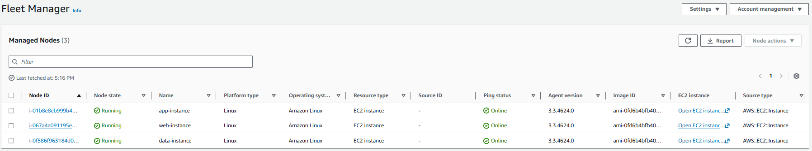

Session Manager was used to open interactive shell sessions on all three instances for testing (see [Section 10](#10-testing-and-verification)) — no SSH client, key pair, or bastion host was used at any point.

---

## 9. Traffic Logging

VPC Flow Logs were enabled on all three subnets to capture IP traffic, with all logs delivered to Amazon S3 for analysis or download.

### 9.1 Destination Choice: S3 over CloudWatch Logs

Flow logs were initially configured to deliver to CloudWatch Logs using `LabRole`. This produced flow logs in an "Active" state that delivered zero data. This was due to conflicts with the IAM roles discussed above.

Flow logs were reconfigured to deliver to an **S3 bucket** instead, which uses a bucket policy for delivery permissions rather than an assumed IAM role. This effectively bypassed the trust policy and role conflict.

| Flow Log | Subnet | Destination | Filter |
|----------|--------|-------------|--------|
| flowlog-web | subnet-web | S3 (`3tier-flow-logs-<suffix>`) | All |
| flowlog-app | subnet-app | S3 (`3tier-flow-logs-<suffix>`) | All |
| flowlog-data | subnet-data | S3 (`3tier-flow-logs-<suffix>`) | All |

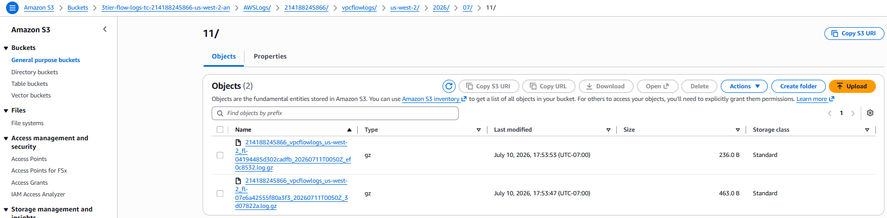

### 9.2 Sample Evidence

Flow log records confirmed both expected traffic and blocked traffic:

- **SSM traffic (allowed):** repeated `ACCEPT` records on port 443 between each instance and the SSM VPC endpoints (`10.0.3.x`).
- **Web tier traffic (allowed):** `ACCEPT` records on port 80 between `web-instance` and external IPs, confirming the web tier serves inbound HTTP traffic as designed.
- **Blocked web→data attempt:** a single `ACCEPT`-labeled record from `web-instance` to `data-instance` on port 3306 showing only 5 packets over a ~56 second window — consistent with repeated SYN retries, not a concrete connection.
- **Perimeter scanning (rejected):** a stream of `REJECT` status from external IPs probing random ports against `web-instance`'s public IP. Confirmation that only the explicitly allowed ports (80, 443) are actually passing.

Raw flow log excerpts corroborating this evidence are included in [`logs/test-logs.log`](logs/test-logs.log).

---

## 10. Testing and Verification

All tests were run using AWS Systems Manager Session Manager (for tests originating from an instance) or a local terminal (for the external SSH test) — no SSH access to any instance was used or required.

Full raw output for all tests below is available in [`logs/test-logs.log`](logs/test-logs.log).

### 10.1 Data Tier Has No Internet Access

From `data-instance`:
```bash
curl -m 5 https://www.google.com
```
**Result:** `curl: (28) Connection timed out after 5000 milliseconds`  
**Confirms:** `rt-data` doesn't have a route to the internet.

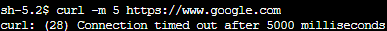

### 10.2 Web → Data Direct Access Is Blocked

From `web-instance`:
```bash
curl -m 5 http://<data-instance-private-ip>:3306
```
**Result:** `curl: (28) Connection timed out after 5002 milliseconds`  
**Confirms:** neither `data-sg` or `data-nacl` allow traffic from `subnet-web` on port 3306. The connection attempt should be silently dropped, not refused.

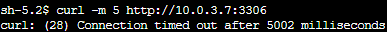

### 10.3 App → Data Access Works on the Database Port

From `app-instance`:
```bash
curl -m 5 http://<data-instance-private-ip>:3306
```
**Result:** `curl: (7) Failed to connect ... Could not connect to server` (instant, ~0–1ms)  
**Confirms:** the network path from `subnet-app` to `subnet-data` on port 3306 is open. While it is refused initially, the instant refusal indicates that the packet did reach the instance but was rejected because no services are listening on that port. 

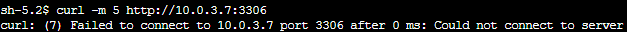

### 10.4 SSH Is Blocked on Every Instance

From a local terminal, targeting `web-instance`'s public IP:
```bash
ssh -i fakekey.pem ec2-user@<web-instance-public-ip>
```
**Result:** `ssh: connect to host <ip> port 22: Connection timed out`  
**Confirms:** no security group in the environment has an inbound rule for port 22 so port 22 connections will be denied.

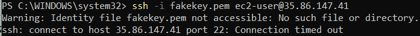

### 10.5 Traffic Logging Captures the Above Activity

Flow log records in the S3 bucket were reviewed following the tests above and corroborate the results — see [Section 9.2](#92-sample-evidence) for the specific records.

### 10.6 Test Summary

| Test | Result |
|------|--------|
| Data subnet has no internet route | Confirmed — 5000ms timeout |
| Web → Data direct access blocked | Confirmed — 5002ms timeout, silently dropped |
| App → Data access on required port | Confirmed — instant refusal, path open, no listener |
| SSH blocked on all instances | Confirmed — connection timed out on port 22 |
| SSM Session Manager access functional | Confirmed — all three instances online in Fleet Manager |
| Flow logs capturing traffic per subnet | Confirmed — ACCEPT/REJECT records reviewed in S3 |